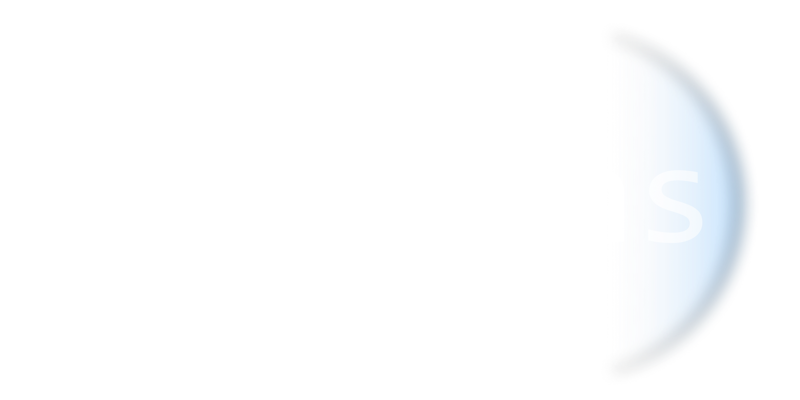

    <picture>
    <source media="(prefers-color-scheme: dark)" srcset="docs/darklens_logo_horizontal_transparent.png">
    <source media="(prefers-color-scheme: light)" srcset="docs/darklens_logo_horizontal_light.png">
    
    </picture>

<b>Lightweight container manager.</b>

## Use cases

- **SSH-less Container Monitoring:** You can add as many components of your infrastructure as you like, and check up on the services running in one place without SSH access.
- **Centralized View for Container Management:** One user-friendly interface to analyze logs and container configs, and interact with them.
- **Goodbye JSON (Hello UI):** Quickly interpretable UI to spare you from untangling data in JSON about your containers.

## Getting started

1. Enter `docker run -p 8000:8000 -d ghcr.io/dyrector-io/darklens:latest` in terminal
2. Open `localhost:8000` in browser
3. Enjoy!

## Development

1. Setup backend

    1. Goto `web/backend`
    2. Run `npm i`
    3. Copy `.env.example` to `.env`

2. Setup frontend

    1. Goto `web/frontend`
    2. Run `npm i`
    3. Copy `.env.example` to `.env`

3. Setup development Traefik

    1. Goto `web`
    2. Run `docker compose -f docker-compose.dev.yaml up`

4. Develop

    1. Goto `web/backend` and run `npm start`
    2. Goto `web/frontend` and run `npx prisma migrate dev` to apply migrations then start using `npm start`
    3. The app will be available on `localhost:8000`
 
    > Make sure the `dev-traefik` container is running as it routes the traffic between the frontend and the backend
